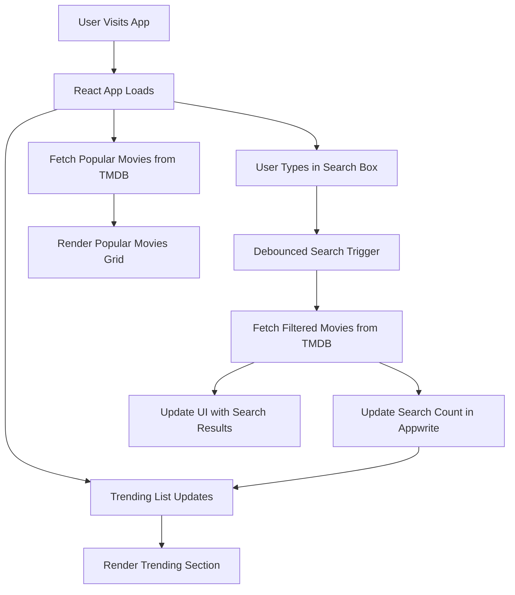

# React Movies — Full Project Explanation & Workflow Documentation

This document explains **exactly how the React Movies project works**, step-by-step — from app startup → fetching data → user search → debouncing → Appwrite tracking → trending algorithm → rendering → deployment.

It is designed for GitHub use so anyone reading your repo can understand the full workflow clearly.

---

# 📌 1. Project Summary

React Movies is a **real-world movie explorer application** built with:

* **React (Vite)** – fast frontend framework
* **Tailwind CSS** – styling
* **TMDB API** – movie data
* **Appwrite** – backend + database for trending movie analytics

The user can:

* View all popular movies
* Search any movie with live suggestions
* See a dynamic trending list based on total user searches

This document explains **how all of this works internally.**

---

# 📌 2. High-Level Architecture

```
User Input → Debounced Search → TMDB API Fetch → UI Updates
                                 ↓
                         Appwrite Database
                         (store search count)
                                 ↓
                         Trending Movies Fetch
                                 ↓
                               UI Render
```

Each part is broken down in detail below.

---

# 📌 3. Application Startup Flow

When the app loads:

1. React Vite dev server initializes.
2. `App.jsx` mounts.
3. Two `useEffect` hooks run:

   * **Fetch All Movies** (default TMDB discover API)
   * **Fetch Trending Movies** (from Appwrite)
4. UI renders loading state → updates when data arrives.

This creates the home page with:

* Hero banner
* Search bar
* Trending movies section
* All movies section

---

# 📌 4. Component Structure Flow

```
App.jsx
│
├── Search.jsx (search bar)
├── MovieCard.jsx (render individual movie)
├── Spinner.jsx (loading UI)
└── Appwrite Utilities
```

**App.jsx** is the brain — it manages all state and data fetching.
**Search.jsx** only handles user input & updates searchTerm.
**MovieCard.jsx** displays each movie.

---

# 📌 5. TMDB API Flow (Fetching Movies)

### Step-by-step:

1. Create TMDB API key.
2. Store it in `.env.local`.
3. Build URL for movies:

   * Popular movies (discover):
     `/discover/movie?sort_by=popularity.desc`
   * Search movies:
     `/search/movie?query=<term>`
4. In `useEffect`, React calls `fetchMovies()`:

   * Set `isLoading = true`
   * Fetch TMDB data
   * If successful → `setMovieList(results)`
   * If failed → `setErrorMessage()`
   * Stop loader

### Result:

Movies appear on UI in the “All Movies” section.

---

# 📌 6. Search Workflow (step-by-step)

User types in the search box:

```
Input → onChange → setSearchTerm → Debounce → TMDB API → Results Displayed
```

### Detailed flow:

1. `Search.jsx` captures keystrokes.
2. It updates `searchTerm` in App.jsx.
3. `useDebounce()` waits ~500ms.
4. After user stops typing → triggers TMDB search API.
5. Movie results update in the UI.

### Why Debounce is necessary?

Without debounce:

```
Typing “Avengers” = 8 API calls
```

With debounce:

```
Typing “Avengers” = 1 API call
```

---

# 📌 7. Appwrite Backend Workflow (Trending System)

This is the intelligent system that tracks which movies are searched most.

### Appwrite setup involves:

* Project → Database → Collection → Attributes:

  * `searchTerm` (string)
  * `count` (integer)
  * `posterURL` (string)
  * `movieId` (integer)

---

## 🔥 Trending Algorithm Flow

When a search result is returned:

1. Get first search result: `data.results[0]`
2. Call `updateSearchCount(searchTerm, movie)`
3. That function:

   * Checks if document with that search term already exists
   * **If exists:** increment `count` by 1
   * **If not:** create a new document with `count = 1`

This permanently stores search popularity.

---

# 📌 8. Fetching Trending Movies

A second function `getTrendingMovies()` is used:

1. Query Appwrite collection
2. Sort by `count` descending
3. Limit to top 5
4. Save into `trendingMovies` state
5. Render them at top of UI

### Trending section shows:

* Rank number
* Movie poster
* Movie title

It updates in real-time as searches increase.

---

# 📌 9. Rendering Logic Flow

React decides what to render based on:

* `isLoading`
* `errorMessage`
* `movieList`
* `trendingMovies`

### Rendering Order:

1. Render Hero + Search
2. If trendingMovies exist → show Trending section
3. Show All Movies section
4. If loading → `<Spinner />`
5. If error → red error text
6. Else → map through movies and show `<MovieCard />`

---

# 📌 10. Deployment Workflow

1. Build project:

   ```bash
   npm run build
   ```
2. Upload `/dist` folder to hosting:

   * Hostinger (used in tutorial)
   * Netlify
   * Vercel
   * GitHub Pages (with config)
3. Add environment variables in hosting dashboard.
4. Publish domain.

---

# 📌 11. Full Workflow Summary (1-page)

```
STEP 1: App loads → Fetch all movies → Display UI
STEP 2: User types → Debounce → Search TMDB
STEP 3: Take first result → Send to Appwrite
STEP 4: Appwrite
        - If movie searched before → count++
        - Else → create new record
STEP 5: Fetch trending movies sorted by count
STEP 6: Render Trending + All Movies
STEP 7: User continues searching → Data updates
STEP 8: Build + deploy
```

This is the entire system end‑to‑end.

---

# 📌 12. Why This Project Is Real‑World Useful

This project demonstrates:

* API integration
* Debounced search (production requirement)
* Database usage
* Real-time analytics
* React hooks & state management
* Component architecture
* Deployment workflow

You can showcase this on your resume or portfolio.

---

# 📌 13. Want More Improvements?

I can also add:
✅ Flow diagrams (ASCII or generated)
✅ Comments inside code
✅ A separate `ARCHITECTURE.md` file
✅ A shorter README version

Just tell me what you need next! 🚀

---

# 🗺️ Architecture Flow Diagram

Below are two representations of the system architecture: a human-friendly ASCII flow (works everywhere) and a Mermaid diagram (useful if GitHub renders Mermaid in your README). Use whichever fits your repo.

## 1) ASCII Diagram (copy into README)

```
User
  │
  ▼
Search Input (Search.jsx)
  │ onChange -> setSearchTerm
  ▼
Debounce Layer (useDebounce)
  │ (wait ~500ms)
  ▼
App.jsx (handles state & effects)
  ├─> If debouncedSearchTerm -> call TMDB Search API
  │        └─> TMDB API (returns movie results)
  │                 └─> App.jsx sets movieList
  │
  └─> On successful search (data.results[0]) -> call Appwrite
            └─> updateSearchCount(searchTerm, movie)
                       ├─> Appwrite DB: find document by searchTerm
                       │       ├─ if exists -> update count++
                       │       └─ else -> create new document (count = 1)
                       └─> Appwrite persists metric

App.jsx also periodically or on-load:
  └─> getTrendingMovies() -> Appwrite: query top N by count -> setTrendingMovies

Finally:
  App.jsx renders UI:
    ├─> Trending (trendingMovies)
    └─> All Movies (movieList)


Static hosting (build -> /dist) -> Hostinger / Vercel / Netlify (env vars set)
```

## 2) Mermaid Diagram (paste in README if supported)

```mermaid
flowchart TD
  U[User]
  S[Search component
(Search.jsx)]
  D[Debounce
(useDebounce)]
  A[App.jsx
(state + effects)]
  TMDB[TMDB API]
  AW[Appwrite DB]
  TM[List: movieList]
  TR[List: trendingMovies]
  HOST[Hosting
(Vercel/Netlify/Hostinger)]

  U --> S
  S --> D
  D --> A
  A -->|search API| TMDB
  TMDB --> A
  A -->|updateSearchCount| AW
  AW --> A
  A --> TM
  A --> TR
  A --> HOST

  style A fill:#fef3c7,stroke:#f59e0b
  style TMDB fill:#e0f2fe,stroke:#0369a1
  style AW fill:#ecfdf5,stroke:#0891b2
  style HOST fill:#eef2ff,stroke:#7c3aed
```

### Notes on using the Mermaid diagram

* GitHub now supports Mermaid in markdown for many repositories; if it doesn't render in your repo, keep the ASCII diagram instead.
* If you want a PNG/SVG export of the Mermaid diagram I can generate a PNG version (and add a link or file to the repo). Tell me which format you prefer.

---

*Diagram appended.*

## Project Flowchart


