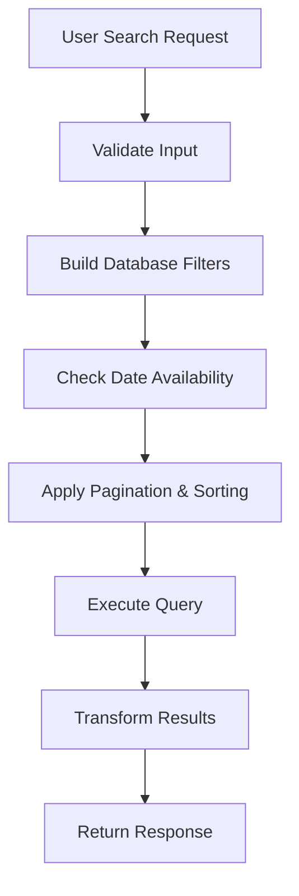
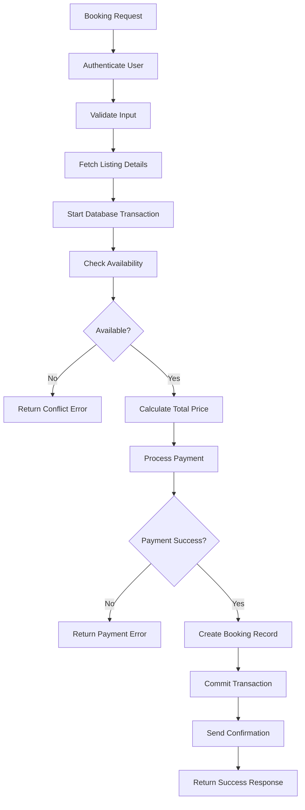

# Booking System API Documentation

A comprehensive booking system with search functionality, availability checking, and atomic booking creation.

## System Architecture

```
User Request → Authentication → Validation → Business Logic → Database → Response
                                    ↓
                            Background Jobs (Notifications)
```

## Core Features

- **Property Search** with location, date, and guest filtering
- **Availability Checking** with conflict detection
- **Atomic Booking Creation** with payment processing
- **Real-time Notifications** via background jobs

---

## Search Flow

### Endpoint
```
GET /search?location=city&checkIn=2024-01-01&checkOut=2024-01-05&guests=2
```

### Process Flow



### Implementation

1. **Input Validation**
   - Validate dates (checkIn < checkOut)
   - Sanitize location string
   - Verify guest count > 0

2. **Database Query**
   ```js
   const filters = {
     location: { $regex: location, $options: 'i' },
     maxGuests: { $gte: guests }
   };
   ```

3. **Availability Check**
   ```js
   // Exclude listings with conflicting bookings
   const conflicts = await Booking.find({
     listingId: { $in: listingIds },
     $or: [
       { checkIn: { $lt: checkOut }, checkOut: { $gt: checkIn } }
     ]
   });
   ```

---

## Booking Flow

### Endpoint
```
POST /bookings
{
  "listingId": "123",
  "checkIn": "2024-01-01",
  "checkOut": "2024-01-05",
  "guests": 2
}
```

### Process Flow



### Atomic Transaction Implementation

```js
const session = await mongoose.startSession();
await session.withTransaction(async () => {
  // Check for conflicts
  const conflicts = await Booking.find({
    listingId,
    $or: [{
      checkIn: { $lt: checkOut },
      checkOut: { $gt: checkIn }
    }]
  }).session(session);
  
  if (conflicts.length) {
    throw new Error('Dates not available');
  }
  
  // Create booking
  await Booking.create([bookingData], { session });
});
```

---

## Key Components

### 1. Authentication Middleware
```js
router.post('/bookings', jwtAuth, validateInput, createBooking);
```

### 2. Input Validation
```js
const bookingSchema = {
  listingId: { type: 'string', required: true },
  checkIn: { type: 'date', required: true },
  checkOut: { type: 'date', required: true },
  guests: { type: 'number', min: 1, required: true }
};
```

### 3. Conflict Detection
```js
function hasDateConflict(checkIn, checkOut, existingBookings) {
  return existingBookings.some(booking => 
    checkIn < booking.checkOut && checkOut > booking.checkIn
  );
}
```

### 4. Price Calculation
```js
function calculateTotal(pricePerNight, checkIn, checkOut) {
  const nights = Math.ceil((checkOut - checkIn) / (1000 * 60 * 60 * 24));
  return nights * pricePerNight;
}
```

---

## Error Handling

| Status Code | Scenario |
|-------------|----------|
| `400` | Invalid input data |
| `401` | Authentication required |
| `402` | Payment processing failed |
| `404` | Listing not found |
| `409` | Booking conflict (dates unavailable) |
| `500` | Server error |

---

## Database Schema

### Listings Collection
```js
{
  _id: ObjectId,
  title: String,
  location: String,
  pricePerNight: Number,
  maxGuests: Number,
  amenities: [String]
}
```

### Bookings Collection
```js
{
  _id: ObjectId,
  listingId: ObjectId,
  userId: ObjectId,
  checkIn: Date,
  checkOut: Date,
  guests: Number,
  totalPrice: Number,
  status: String, // 'confirmed', 'cancelled'
  createdAt: Date
}
```

---

## Performance Optimizations

### Database Indexes
```js
// Compound index for availability queries
db.bookings.createIndex({ 
  "listingId": 1, 
  "checkIn": 1, 
  "checkOut": 1 
});

// Text index for location search
db.listings.createIndex({ 
  "location": "text",
  "title": "text" 
});
```

### Caching Strategy
- Cache popular search results (Redis, 5-minute TTL)
- Cache listing details (15-minute TTL)
- Use CDN for static assets

---

## Testing Strategy

### Unit Tests
```js
describe('Booking Controller', () => {
  it('should create booking when dates available', async () => {
    // Mock available dates
    // Call createBooking
    // Assert booking created
  });
  
  it('should return conflict when dates unavailable', async () => {
    // Mock conflicting booking
    // Call createBooking
    // Assert 409 response
  });
});
```

### Integration Tests
- Test concurrent booking attempts
- Verify transaction rollback on payment failure
- Test search with various filter combinations

---

## Deployment & Monitoring

### Environment Setup
```bash
NODE_ENV=production
DATABASE_URL=mongodb://...
REDIS_URL=redis://...
JWT_SECRET=your-secret-key
PAYMENT_API_KEY=stripe-key
```

### Health Checks
```js
app.get('/health', (req, res) => {
  res.json({
    status: 'healthy',
    timestamp: new Date().toISOString(),
    database: 'connected'
  });
});
```

### Logging & Metrics
- Log all booking attempts with correlation IDs
- Monitor booking success/failure rates
- Track search query performance
- Alert on high conflict rates (indicates race conditions)

---

## Getting Started

1. **Clone Repository**
   ```bash
   git clone <repository-url>
   cd booking-system
   ```

2. **Install Dependencies**
   ```bash
   npm install
   ```

3. **Environment Setup**
   ```bash
   cp .env.example .env
   # Edit .env with your configuration
   ```

4. **Database Setup**
   ```bash
   npm run db:migrate
   npm run db:seed
   ```

5. **Start Development Server**
   ```bash
   npm run dev
   ```

6. **Run Tests**
   ```bash
   npm test
   ```

---

## API Examples

### Search Properties
```bash
curl "http://localhost:3000/search?location=paris&checkIn=2024-01-01&checkOut=2024-01-05&guests=2"
```

### Create Booking
```bash
curl -X POST http://localhost:3000/bookings \
  -H "Authorization: Bearer <token>" \
  -H "Content-Type: application/json" \
  -d '{
    "listingId": "507f1f77bcf86cd799439011",
    "checkIn": "2024-01-01",
    "checkOut": "2024-01-05",
    "guests": 2
  }'
```

---

## License

This project is licensed under the MIT License.
