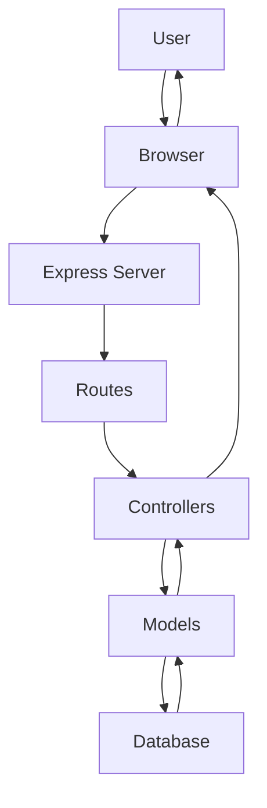
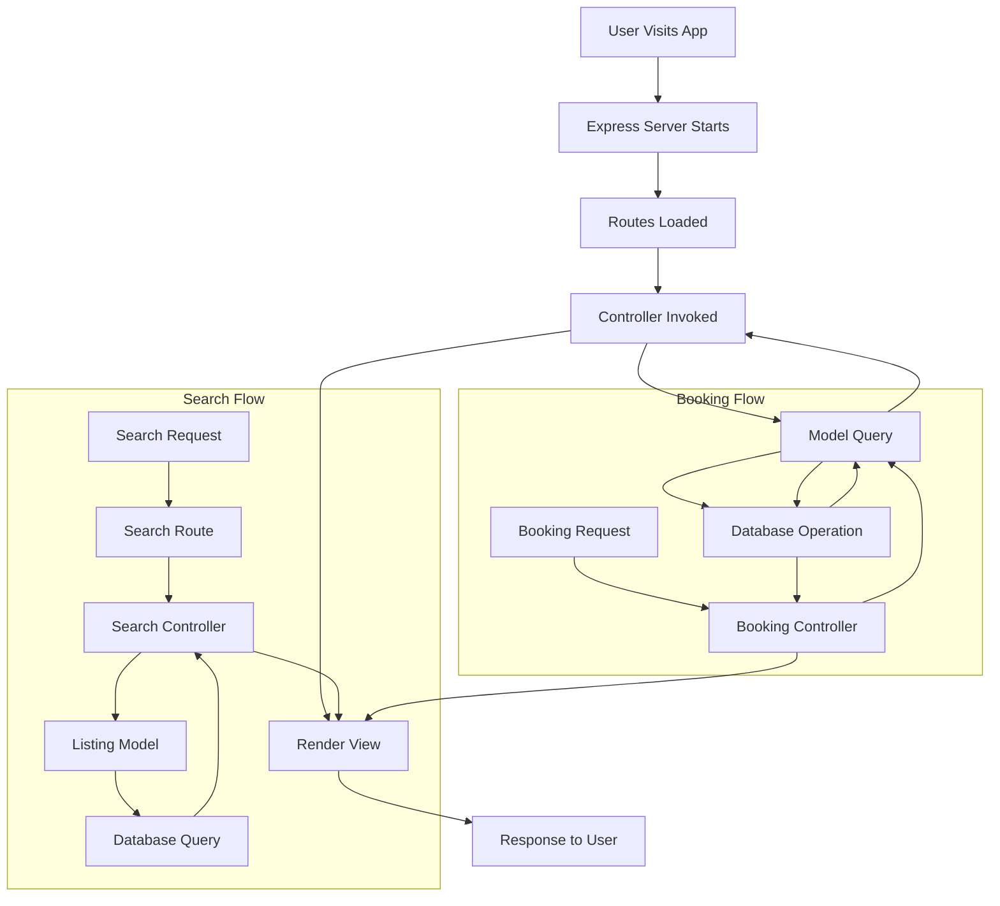

# Trip-Hive-MVC — Full Project Documentation

This document explains **how the Trip-Hive-MVC project works end-to-end**, intended for your GitHub repository. It covers the project architecture (MVC), detailed runtime flow, component interactions, and data flow.

---

## Project Summary

**Trip-Hive-MVC** is a web platform built using the **Model-View-Controller (MVC)** pattern for managing travel accommodations. The core features are:

* Browse, search, and view accommodation listings
* Book accommodations and manage bookings
* Hosts can create and manage listings
* Clean separation of concerns (models, views, controllers) for maintainability

The repo uses JavaScript on the server (Node.js / Express) and EJS templates for views. Static assets (CSS, JS, images) are in `public/`.

---

## Tech Stack

* Node.js + Express (server)
* EJS (templating engine)
* CSS (and likely Bootstrap or custom styles in `public/`)
* Database: MongoDB or SQL (check `schema.js` for exact implementation)
* Project structure follows MVC: `models/`, `views/`, `controllers/`, `routes/`

---

## Folder Structure

```
Trip-Hive-MVC/
├─ controllers/        # request handlers (business logic)
├─ models/             # DB models / schemas
├─ routes/             # route definitions connecting URLs -> controllers
├─ views/              # EJS templates (UI)
├─ public/             # static assets (css, js, images)
├─ utils/              # helper functions, middlewares
├─ init/               # initialization scripts
├─ app.js              # app entry point
├─ cloudConfig.js      # cloud / DB config
├─ schema.js           # DB table/collection schema
├─ package.json        # dependencies & run scripts
└─ README.md
```

---

## Architecture Overview

**User → Routes → Controllers → Models (DB) → Controllers → Views → User**

---

## Request Handling Flow

1. **Client** visits a URL (e.g., `/listings`, `/search`, `/book/:id`)
2. **Routes** file maps the URL and HTTP method to a controller function
3. **Controller** receives the request, validates input, and calls model layer methods
4. **Model** interacts with the database (query, create, update) and returns results
5. **Controller** formats data and renders a **view** (EJS) or returns JSON (for AJAX)
6. The **view** (EJS) renders HTML with the data and responds to the client

Example: `GET /listings`

* `routes/listings.js` → `controllers/listingsController.getAllListings()` → `models/Listing.find()` → return results → `res.render('listings', { listings })`

---

## Key Components

### Controllers

* Contain request-level logic: read params, call models, choose views, handle errors
* Examples: `authController.js`, `listingsController.js`, `bookingController.js`

### Models

* Represent DB schema + encapsulate DB queries
* Should be small, focused functions: `findById`, `createBooking`, `updateAvailability`

### Views (EJS)

* Template files in `views/` produce the HTML UI
* Keep markup simple; heavy logic belongs to controllers or utils

### Routes

* Map URL + method to controller functions
* Keep route files tiny; use middlewares (auth, validation) where needed

### Utils & Middleware

* Reusable helpers: input validation, auth checks, formatters, pagination helpers

---

## Search + Booking Flow

### Search

1. User enters search criteria (location, dates, guests)
2. Client sends `GET /search?q=...&checkin=...&checkout=...`
3. Router forwards to `searchController.search()`
4. Controller validates query, calls `Listing.findAvailable({ ... })`
5. Model queries DB, applies date-availability filtering and returns matches
6. Controller renders `search-results.ejs` with matching listings

### Booking

1. User clicks "Book" on a listing → client loads booking form `GET /book/:listingId`
2. Fill details → form POST to `/book/:listingId`
3. Booking controller validates user/session, checks availability again
4. If available → create booking record, mark dates as reserved, send confirmation
5. If conflict → return error page or redirect with message

---

## Database Schema

Typical entities in Trip-Hive-MVC:

* **User**: id, name, email, passwordHash, role (guest/host/admin)
* **Listing**: id, hostId (user), title, description, location, price, amenities, images, availability
* **Booking**: id, listingId, userId, checkIn, checkOut, totalPrice, status
* **Review** (optional): id, listingId, userId, rating, comment

---

## Authentication & Authorization

* Use sessions (express-session) or JWT for auth
* Protect routes for creating listings or booking (middleware: `authMiddleware`)
* Host-only actions (edit listing) should check the `hostId` vs `req.user.id`

---

## Error Handling & Validation

* Centralize validation in `utils/validation` or use libraries (Joi/express-validator)
* Controllers should catch DB errors and render friendly error pages
* Use a global error handler middleware (last `app.use(errHandler)`)

---

## Deployment & Environment Setup

1. Create `.env` with DB credentials, session secret, mail API keys
2. Install dependencies:

   ```bash
   npm install
   ```
3. Run locally:

   ```bash
   npm run dev        # or `node app.js` depending on package scripts
   ```
4. For production:

   * Use a managed host (Heroku, Render, DigitalOcean App Platform, or VPS)
   * Set environment variables in the host dashboard
   * Use a process manager (pm2) and enable HTTPS/SSL

---

## Security Best Practices

* Do NOT commit `cloudConfig.js` credentials or `.env` to GitHub
* Hash passwords with bcrypt and store only the hash
* Sanitize user inputs (prevent XSS via templates and stored content)
* Use CSRF tokens on POST forms
* Rate-limit endpoints that can be abused (login/search)

---

## Architecture Flow Diagram

### ASCII Diagram

```
User
 │
 ▼
 Browser (HTML / EJS)  <--->  Server (Express)
                            │
 Routes ------------------> Controllers
                            │
 Controllers --------------> Models
                            │
 Models <-------------------> Database
                            │
 Controllers --------------> Views (EJS render)
                            │
 Response -> Browser (UI)
```

### System Flow



---

## Project Workflow



---

## Getting Started

1. **Clone Repository**
   ```bash
   git clone <repository-url>
   cd Trip-Hive-MVC
   ```

2. **Install Dependencies**
   ```bash
   npm install
   ```

3. **Environment Setup**
   ```bash
   cp .env.example .env
   # Edit .env with your configuration
   ```

4. **Start Development Server**
   ```bash
   npm run dev
   ```

5. **Run Tests**
   ```bash
   npm test
   ```

---

## Future Improvements

* Add unit tests for controllers & models (Jest + Supertest)
* Add integration tests for routes
* Improve search with geolocation-based ranking
* Add payment integration (Stripe) for bookings
* Add email confirmations (Nodemailer) and background jobs
* Dockerize the app and provide docker-compose for DB + app

---


## Getting Started

1. **Clone Repository**
   ```bash
   git clone <repository-url>
   cd booking-system
   ```

2. **Install Dependencies**
   ```bash
   npm install
   ```

3. **Environment Setup**
   ```bash
   cp .env.example .env
   # Edit .env with your configuration
   ```

4. **Start Development Server**
   ```bash
   npm run dev
   ```

5. **Run Tests**
   ```bash
   npm test
   ```

---


