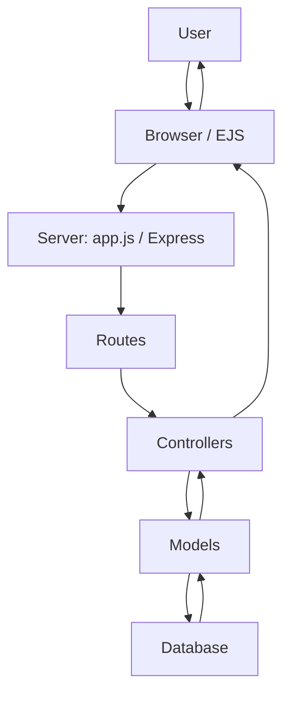

# Trip-Hive-MVC — Full Project Explanation & Workflow Documentation

This document explains **how the Trip-Hive-MVC project works end‑to‑end**, intended for your GitHub repository. It covers what the project does, its architecture (MVC), detailed runtime flow, component interactions, data flow, and includes diagrams and a project flowchart you can paste into your README.

---

## 1. Project Summary

**Trip‑Hive‑MVC** is a web platform built using the **Model–View–Controller (MVC)** pattern for managing travel accommodations. The core features are:

* Browse, search, and view accommodation listings
* Book accommodations and manage bookings
* Hosts can create and manage listings
* Clean separation of concerns (models, views, controllers) for maintainability

The repo uses JavaScript on the server (Node.js / Express or similar) and EJS templates for views (EJS is visible in repo languages). Static assets (CSS, JS, images) are in `public/`.

> Note: If your project uses a different database (MongoDB, PostgreSQL, etc.), the doc notes where to adjust DB instructions.

---

## 2. Tech Stack (observed / recommended)

* Node.js + Express (server)
* EJS (templating engine)
* CSS (and likely Bootstrap or custom styles in `public/`)
* Database: (check `schema.js` to see exact DB — common choices: MongoDB or SQL)
* Project structure follows MVC: `models/`, `views/`, `controllers/`, `routes/`

---

## 3. Folder Structure (from repo)

```
Trip-Hive-MVC/
├─ controllers/        # request handlers (business logic)
├─ models/             # DB models / schemas
├─ routes/             # route definitions connecting URLs -> controllers
├─ views/              # EJS templates (UI)
├─ public/             # static assets (css, js, images)
├─ utils/              # helper functions, middlewares
├─ init/               # initialization scripts
├─ app.js              # app entry point
├─ cloudConfig.js      # cloud / DB config (credentials kept out of repo)
├─ schema.js           # DB table/collection schema (seed/schema definitions)
├─ package.json        # dependencies & run scripts
└─ README.md
```

---

## 4. High-Level Architecture (one-liner)

**User → Routes → Controllers → Models (DB) → Controllers → Views → User**

---

## 5. Request Handling Flow (Detailed)

1. **Client** visits a URL (e.g., `/listings`, `/search`, `/book/:id`).
2. **Routes** file maps the URL and HTTP method to a controller function.
3. **Controller** receives the request, validates input, and calls model layer methods.
4. **Model** interacts with the database (query, create, update) and returns results.
5. **Controller** formats data and renders a **view** (EJS) or returns JSON (for AJAX).
6. The **view** (EJS) renders HTML with the data and responds to the client.

Example: `GET /listings`

* `routes/listings.js` → `controllers/listingsController.getAllListings()` → `models/Listing.find()` → return results → `res.render('listings', { listings })`.

---

## 6. Key Components & Responsibilities

### Controllers

* Contain request-level logic: read params, call models, choose views, handle errors.
* Examples: `authController.js`, `listingsController.js`, `bookingController.js`.

### Models

* Represent DB schema + encapsulate DB queries.
* Should be small, focused functions: `findById`, `createBooking`, `updateAvailability`.

### Views (EJS)

* Template files in `views/` produce the HTML UI.
* Keep markup simple; heavy logic belongs to controllers or utils.

### Routes

* Map URL + method to controller functions.
* Keep route files tiny; use middlewares (auth, validation) where needed.

### Utils & Middleware

* Reusable helpers: input validation, auth checks, formatters, pagination helpers.

---

## 7. Search + Booking Flow (Example: end-to-end sequence)

### Search

1. User enters search criteria (location, dates, guests).
2. Client sends `GET /search?q=...&checkin=...&checkout=...`.
3. Router forwards to `searchController.search()`.
4. Controller validates query, calls `Listing.findAvailable({ ... })`.
5. Model queries DB, applies date-availability filtering and returns matches.
6. Controller renders `search-results.ejs` with matching listings.

### Booking

1. User clicks "Book" on a listing → client loads booking form `GET /book/:listingId`.
2. Fill details → form POST to `/book/:listingId`.
3. Booking controller validates user/session, checks availability again.
4. If available → create booking record, mark dates as reserved, send confirmation (email or UI) and render success page.
5. If conflict → return error page or redirect with message.

---

## 8. Database Schema (high level)

Typical entities in Trip-Hive-MVC:

* **User**: id, name, email, passwordHash, role (guest/host/admin)
* **Listing**: id, hostId (user), title, description, location, price, amenities, images, availability
* **Booking**: id, listingId, userId, checkIn, checkOut, totalPrice, status
* **Review** (optional): id, listingId, userId, rating, comment

Your repository's `schema.js` will contain the exact fields; keep secrets and credentials out of version control and use environment variables.

---

## 9. Authentication & Authorization

* Use sessions (express-session) or JWT for auth.
* Protect routes for creating listings or booking (middleware: `authMiddleware`).
* Host-only actions (edit listing) should check the `hostId` vs `req.user.id`.

---

## 10. Error Handling & Validation

* Centralize validation in `utils/validation` or use libraries (Joi/express-validator).
* Controllers should catch DB errors and render friendly error pages.
* Use a global error handler middleware (last `app.use(errHandler)`).

---

## 11. Deployment & Environment Setup

1. Create `.env` with DB credentials, session secret, mail API keys.
2. Install dependencies:

   ```bash
   npm install
   ```
3. Run locally:

   ```bash
   npm run dev        # or `node app.js` depending on package scripts
   ```
4. For production:

   * Use a managed host (Heroku, Render, DigitalOcean App Platform, or VPS)
   * Set environment variables in the host dashboard
   * Use a process manager (pm2) and enable HTTPS/SSL

---

## 12. Security Best Practices

* Do NOT commit `cloudConfig.js` credentials or `.env` to GitHub.
* Hash passwords with bcrypt and store only the hash.
* Sanitize user inputs (prevent XSS via templates and stored content).
* Use CSRF tokens on POST forms.
* Rate-limit endpoints that can be abused (login/search).

---

## 13. Architecture Flow Diagram

### ASCII diagram (copy into README)

```
User
 │
 ▼
 Browser (HTML / EJS)  <--->  Server (Express)
                            │
 Routes ------------------> Controllers
                            │
 Controllers --------------> Models
                            │
 Models <-------------------> Database
                            │
 Controllers --------------> Views (EJS render)
                            │
 Response -> Browser (UI)
```

### Mermaid diagram (paste into README if your GitHub supports Mermaid)



---

## 14. Project Flowchart (Mermaid)

```mermaid
flowchart TD
    A[User Visits App] --> B[Express Server boots (app.js)]
    B --> C[Routes loaded (routes/*.js)]
    C --> D[Controller invoked]
    D --> E[Model: DB query / update]
    E --> F[Database reads / writes]
    F --> E
    E --> D
    D --> G[Render EJS view or JSON]
    G --> H[User receives response]

    subgraph Search
      S1[User enters search] --> S2[Route: /search]
      S2 --> S3[searchController.search()]
      S3 --> S4[Model: Listing.findAvailable()]
      S4 --> S5[DB returns matches]
      S5 --> S3
      S3 --> G
    end

    subgraph Booking
      B1[Booking POST] --> B2[bookingController.createBooking()]
      B2 --> E
      E --> F
      F --> B2
      B2 --> G
    end
```

---

## 15. Next Improvements / Suggested Tasks

* Add unit tests for controllers & models (Jest + Supertest)
* Add integration tests for routes
* Improve search with geolocation-based ranking
* Add payment integration (Stripe) for bookings
* Add email confirmations (Nodemailer) and background jobs (Bull / Redis)
* Dockerize the app and provide docker-compose for DB + app

---

## 16. How I can help next

I can:

* Create a polished `README.md` (short + long form) ready to commit.
* Generate a `CONTRIBUTING.md` and `DEVELOPER_SETUP.md` with exact commands.
* Create architecture diagrams exported as PNG or SVG and add them to the repo.
* Scan `schema.js` and `cloudConfig.js` and produce specific DB setup steps (if you want me to parse those files, I can fetch and summarise their contents).

Tell me which of these you'd like me to do next and I’ll add it directly to the repository document.

---

# 🔍 Detailed Request Handling — Search & Booking Flows (Expanded)

Below are **step-by-step, technical breakdowns** of how requests should be handled in Trip‑Hive‑MVC for search and booking — including controller responsibilities, model operations, middleware, edge cases, and sample pseudocode and database query patterns.

These are implementation-ready descriptions you can drop into controllers/models in your repo.

---

## A. Common building blocks used by both flows

### 1. Middleware stack (typical order)

* `helmet()` – security headers
* `express.json()` / `express.urlencoded()` – parse body
* `session()` or `jwtAuth()` – authentication
* `rateLimiter()` – prevent abuse on endpoints (search/login)
* `validateInput(schema)` – request validation

### 2. Utilities

* `validateDates(checkIn, checkOut)` → ensures checkIn < checkOut, not in the past
* `calculateTotalPrice(pricePerNight, checkIn, checkOut, fees)`
* `datesOverlap(rangeA, rangeB)` → boolean
* `formatResponse(data, meta)` → consistent API shape

---

## B. SEARCH FLOW (Detailed)

### Goal

Return a list of available listings that match user criteria (location, dates, guests, filters). Prefer server filtering + DB indices to avoid heavy application-level filtering.

### Endpoint

`GET /search?q=:location&checkIn=YYYY-MM-DD&checkOut=YYYY-MM-DD&guests=2&page=1`

### 1. Route defi# Booking System API Documentation

## Search Implementation

### 1. Route Definition (Express)

```js
router.get('/search', validateInput(searchSchema), searchController.search);
```

### 2. Controller responsibilities (`searchController.search(req, res)`) — step-by-step

1. Parse & validate query params (location, dates, guests, page, sort). Use `validateDates()`.
2. Build DB query filters:

   * `location: { $regex: location, $options: 'i' }` or use geospatial query if coords provided
   * `maxGuests: { $gte: guests }`
   * `price: { $gte: minPrice, $lte: maxPrice }`
3. Date availability: exclude listings with conflicting bookings. Two approaches:

   * (a) **DB-side** query joining `bookings` to exclude overlaps (preferred for large data)
   * (b) **Index + precomputed availability** (best for scale)
4. Apply pagination & sorting (limit, skip or SQL `LIMIT/OFFSET`).
5. Execute DB query and transform results to a compact DTO (id, title, price, thumbnail, rating, summary).
6. Return `200 OK` with `{ data: listings, page, total }`.

### 3. Sample MongoDB query for date exclusion

```js
// dates are ISO strings
const conflicts = await Booking.find({
  listingId: { $in: listingIds },
  $or: [
    { checkIn: { $lt: checkOut }, checkOut: { $gt: checkIn } }
  ]
});
// Exclude listingIds that appear in conflicts
```

### 4. SQL-style query pattern

```sql
SELECT l.*
FROM listings l
WHERE l.location ILIKE '%:location%'
  AND l.max_guests >= :guests
  AND NOT EXISTS (
    SELECT 1 FROM bookings b
    WHERE b.listing_id = l.id
      AND b.check_in < :checkOut
      AND b.check_out > :checkIn
  )
ORDER BY :sort
LIMIT :limit OFFSET :offset;
```

### 5. Edge cases & optimizations

* If dates are not provided, only filter by location & guests.
* Use DB indices on `listing.location`, `listing.max_guests`, `bookings(listing_id, check_in, check_out)`.
* For high traffic, cache frequent searches (Redis) with short TTL.
* Return friendly suggestions when 0 results found (nearby places, date relaxation).

---

## C. BOOKING FLOW (Detailed & Atomic)

### Goal

Create a booking for a listing for a date range, ensure availability, reserve dates atomically, calculate price, record the booking, and notify the user.

### Endpoint

`POST /bookings` with body `{ listingId, userId, checkIn, checkOut, guests, paymentInfo? }`

### 1. Route & middlewares

```js
router.post('/bookings', jwtAuth, validateInput(bookingSchema), rateLimiter, bookingController.createBooking);
```

### 2. Controller responsibilities (`bookingController.createBooking(req, res)`) — step-by-step

1. **Authenticate user** (middleware provided `req.user`).
2. **Validate payload** (dates, guest count). Call `validateDates()`.
3. **Fetch listing** and check `maxGuests` >= requested guests.
4. **Check availability (atomic)** — two main strategies:

   * **DB transaction (recommended)**
   * **Optimistic locking via version field or unique reservations table**
5. **Calculate total price**: `nights * pricePerNight + fees`.
6. **Payment processing** (if required): call payment gateway and verify success. If payment fails → return 402 (Payment Required).
7. **Create booking record** and mark dates reserved (if separate availability table) inside the same transaction.
8. **Commit transaction** and respond with booking details.
9. **Send confirmation** (email/SMS) in a background job (do not block response).

### 3. Availability check — implementation approaches

#### Approach 1 — DB transaction (SQL / Mongo with transactions)

* Start DB transaction.
* Re-run overlapping bookings query with `FOR UPDATE` or select with lock to prevent concurrent inserts.
* If no overlap → insert booking and commit.
* If overlap → rollback and return conflict (409).

Pseudo (SQL):

```sql
BEGIN;
SELECT 1 FROM bookings
WHERE listing_id = :listingId
  AND check_in < :checkOut
  AND check_out > :checkIn
FOR UPDATE;
-- if row exists -> ROLLBACK and return 409
INSERT INTO bookings (listing_id, user_id, check_in, check_out, total_price, status)
VALUES (...);
COMMIT;
```

In Node.js with Mongo and transactions:

```js
const session = await mongoose.startSession();
await session.withTransaction(async () => {
  const conflicts = await Booking.find({ listingId, $or: [{checkIn: {$lt: checkOut}, checkOut: {$gt: checkIn}}] }).session(session);
  if (conflicts.length) throw new Error('Conflict');
  await Booking.create([{...bookingData}], { session });
});
```

#### Approach 2 — Optimistic locking / unique reservation tokens

* Use a table `reservations` with unique constraint on `(listing_id, date)` (or date bucket)
* To reserve N nights, insert N rows; on unique violation -> fail
* Better for simpler concurrency but more writes

#### Approach 3 — Precomputed availability calendar

* Maintain availability slots per listing (e.g., `availability` collection)
* Update availability atomically with transactions

### 4. Payment & Idempotency

* If payments are involved, ensure **idempotency key** on requests (from client) so retries don't create duplicate bookings.
* Store `paymentIntentId` and check if it's already processed before creating booking.

### 5. Post-booking actions

* Send confirmation email via background worker (Bull + Redis / AWS SQS)
* Update listing analytics (e.g., increment booking count)
* Notify host via email/notification

### 6. Error handling & response codes

* `400 Bad Request` → validation failed
* `401 Unauthorized` → not logged in
* `402 Payment Required` → payment failed
* `409 Conflict` → dates already booked
* `500 Internal Server Error` → unexpected

---

## D. Sample Controller Pseudocode (Combining all pieces)

### Search Controller

```js
exports.search = async (req, res) => {
  const { q: location, checkIn, checkOut, guests, page = 1 } = req.query;
  // Validate
  if (checkIn && !validateDates(checkIn, checkOut)) {
    return res.status(400).json({ error: 'Invalid dates' });
  }

  // Build filters
  const filters = { location: buildLocationFilter(location), maxGuests: { $gte: guests } };

  // If dates provided, exclude listings with conflicting bookings (DB query shown earlier)
  const listings = await Listing.searchAvailable(filters, { checkIn, checkOut, page });

  return res.json({ data: listings });
};
```

### Booking Controller

```js
exports.createBooking = async (req, res) => {
  const { listingId, checkIn, checkOut, guests, paymentInfo, idempotencyKey } = req.body;
  const userId = req.user.id;

  // Validate dates & guests
  if (!validateDates(checkIn, checkOut)) return res.status(400).send('Invalid dates');

  const listing = await Listing.findById(listingId);
  if (!listing) return res.status(404).send('Listing not found');
  if (listing.maxGuests < guests) return res.status(400).send('Too many guests');

  // Start transaction
  try {
    await db.transaction(async (tx) => {
      const conflict = await Booking.findConflict(listingId, checkIn, checkOut, tx);
      if (conflict) throw new ConflictError('Dates not available');

      // Optionally process payment (external) - must be idempotent
      const total = calculateTotal(listing.pricePerNight, checkIn, checkOut);
      if (paymentInfo) {
        const payment = await payments.charge({ amount: total, paymentInfo, idempotencyKey });
        if (!payment.success) throw new PaymentError();
      }

      const booking = await Booking.create({ listingId, userId, checkIn, checkOut, total }, { transaction: tx });
      // Commit automatically when transaction function finishes
      res.status(201).json({ booking });

      // Enqueue notification (outside transaction)
      queue.add('sendBookingConfirmation', { bookingId: booking.id });
    });
  } catch (err) {
    if (err instanceof ConflictError) return res.status(409).send(err.message);
    if (err instanceof PaymentError) return res.status(402).send('Payment failed');
    console.error(err);
    return res.status(500).send('Server error');
  }
};
```

---

## E. Testing & Validation Recommendations

* Unit test controllers with mocked models (Jest + sinon)
* Integration test booking endpoint ensuring concurrent bookings handled (use test DB)
* Test edge cases: same-time bookings from two clients, partial payment success, invalid dates

---

## F. Monitoring & Observability

* Log booking creation events with correlation IDs
* Monitor rate of `409 Conflict` responses — could indicate DB race conditions
* Track search query frequency to optimize caching

---

## Getting Started

1. **Clone Repository**
   ```bash
   git clone <repository-url>
   cd booking-system
   ```

2. **Install Dependencies**
   ```bash
   npm install
   ```

3. **Environment Setup**
   ```bash
   cp .env.example .env
   # Edit .env with your configuration
   ```

4. **Start Development Server**
   ```bash
   npm run dev
   ```

5. **Run Tests**
   ```bash
   npm test
   ```

---

## License

This project is licensed under the MIT License.
